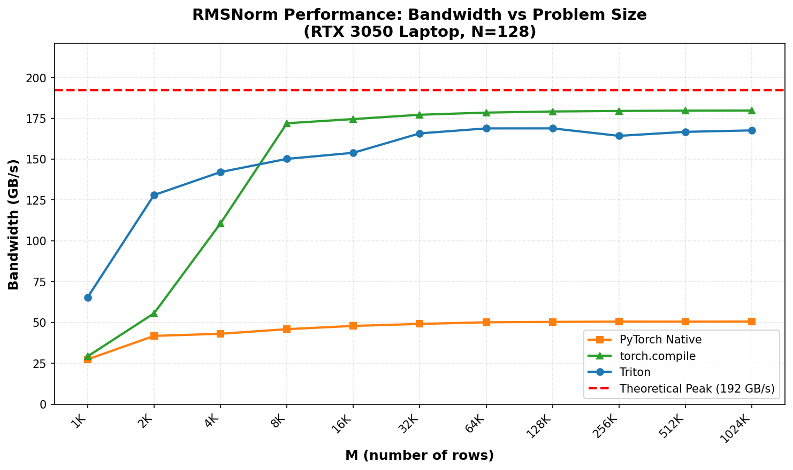

# rmsnorm-triton

RMSNorm in Triton.

RMSNorm is the normalization layer used in LLaMA, Mistral, Gemma, and most modern LLMs. It's simpler than LayerNorm (no mean subtraction, no beta) and works just as well.

## quick start

```bash
pip install torch triton matplotlib pandas numpy
python benchmark.py
```

You should see something like this (according your system specs):

```
============================================================
RMSNorm Triton Benchmark
============================================================

GPU: NVIDIA GeForce RTX 3050 Laptop GPU
Compute Capability: 86
Theoretical Peak Bandwidth: ~192 GB/s
PyTorch: 2.5.1+cu121
Triton: 3.1.0

============================================================
Verification
============================================================
  PyTorch Native : max_error=0.00e+00 [PASS]
  Triton         : max_error=9.54e-07 [PASS]
  torch.compile  : max_error=9.54e-07 [PASS]

============================================================
Benchmarking
============================================================
M=    1024 | Best: Triton          @   65.4 GB/s
M=    2048 | Best: Triton          @  128.0 GB/s
M=    4096 | Best: Triton          @  142.1 GB/s
M=    8192 | Best: torch.compile   @  172.0 GB/s
...
M= 1048576 | Best: torch.compile   @  179.8 GB/s

============================================================
Results Summary (at M=1,048,576)
============================================================

Method               Bandwidth       % of Peak
------------------------------------------------------------
torch.compile             179.8 GB/s       93.6%
Triton                    167.6 GB/s       87.3%
PyTorch Native             50.6 GB/s       26.3%

Theoretical Peak: 192 GB/s
```

**Key findings:**
- `torch.compile` hits **93.6%** of theoretical peak bandwidth - it wins at large batch sizes
- Triton kernel hits **87.3%** - still excellent, and wins at small batch sizes (M < 8192)
- PyTorch Native (torch.nn.functional.rms_norm) is slow in v2.5.1 because it's not fused - multiple kernel launches. A native fused CUDA kernel is coming in PyTorch 2.10+.



## usage

```python
import torch
from rmsnorm import triton_rmsnorm, pytorch_native_rmsnorm

x = torch.randn(1024, 128, device='cuda', dtype=torch.float32)
weight = torch.randn(128, device='cuda', dtype=torch.float32)

# fastest (for large tensors)
compiled_rmsnorm = torch.compile(pytorch_native_rmsnorm)
y = compiled_rmsnorm(x, weight)

# fast (good for all sizes, no compilation overhead)
y = triton_rmsnorm(x, weight)

# baseline (not fused, slow)
y_ref = pytorch_native_rmsnorm(x, weight)
```

## what's RMSNorm?

```
RMSNorm(x) = x / sqrt(mean(x^2) + eps) * weight
```

That's the whole thing. Unlike LayerNorm, there's no mean subtraction and no learned bias. Just normalize by the root mean square and scale. The [original paper](https://arxiv.org/abs/1910.07467) showed this works just as well as LayerNorm while being faster.

## how the Triton kernel works

Each row of the input gets processed by one block. The kernel:
1. Loads a row into registers
2. Computes sum of squares with `tl.sum(x * x)`
3. Computes `rsqrt(sum_sq / N + eps)` 
4. Multiplies by the weight and writes out

The whole thing is ~20 lines of Triton code in `rmsnorm.py`. Go read it.

## why is torch.compile faster than Triton?

At large batch sizes, `torch.compile` beats our hand-written Triton kernel. Why?

1. **Better autotuning** - torch.compile/inductor has more sophisticated autotuning than our simple Triton kernel
2. **We didn't try that hard** - the Triton kernel is intentionally simple (~20 lines). A production Triton kernel would have more optimizations
3. **This is actually good news** - for most use cases, just use `torch.compile` and you're done

At small batch sizes (M < 8192), Triton wins because:
1. **Lower overhead** - Triton kernels launch faster
2. **No compilation** - `torch.compile` has first-call compilation cost

## implementations

| Implementation | Description | When to use |
|----------------|-------------|-------------|
| `pytorch_native_rmsnorm` | Uses `torch.nn.functional.rms_norm` | Debugging, baseline |
| `pytorch_compiled_rmsnorm` | Same as native, wrapped with `torch.compile` | Large batches, production |
| `triton_rmsnorm` | Hand-written Triton kernel | Small batches, no compile overhead |

## files

```
rmsnorm.py      # the implementations (~80 lines)
benchmark.py    # benchmarking script
outputs/        # benchmark results (png + csv)
```

## requirements

- Python 3.12 (torch.compile doesn't work on 3.14+)
- PyTorch 2.0+
- Triton 2.1+
- NVIDIA GPU with CUDA support

## references

- [Root Mean Square Layer Normalization](https://arxiv.org/abs/1910.07467) - Zhang & Sennrich (2019)
- [Triton](https://triton-lang.org/) - OpenAI's GPU programming language

## license

MIT
